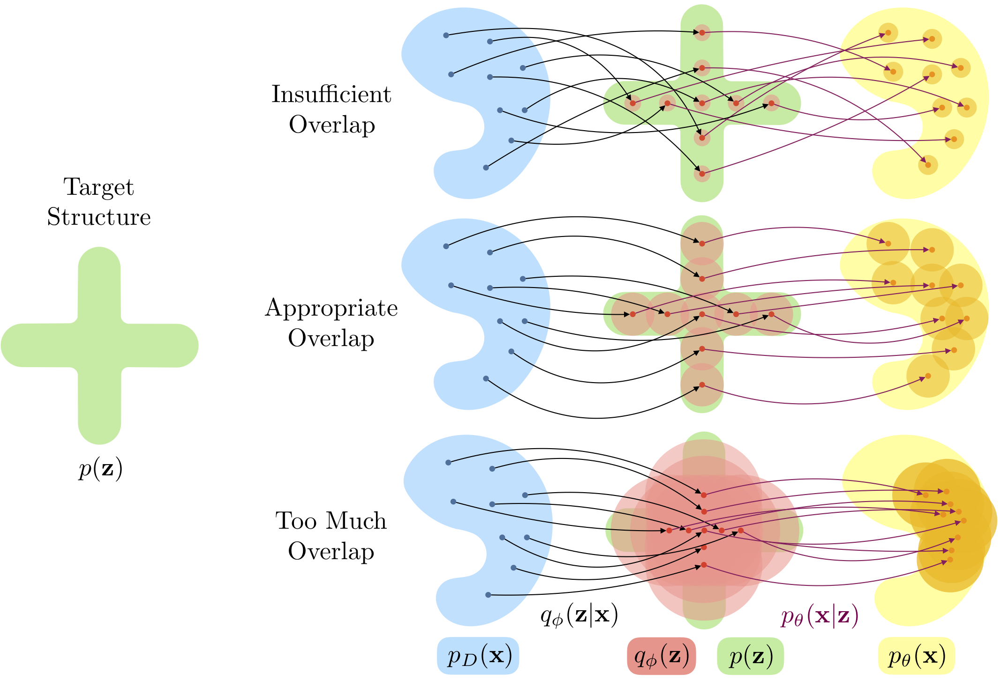
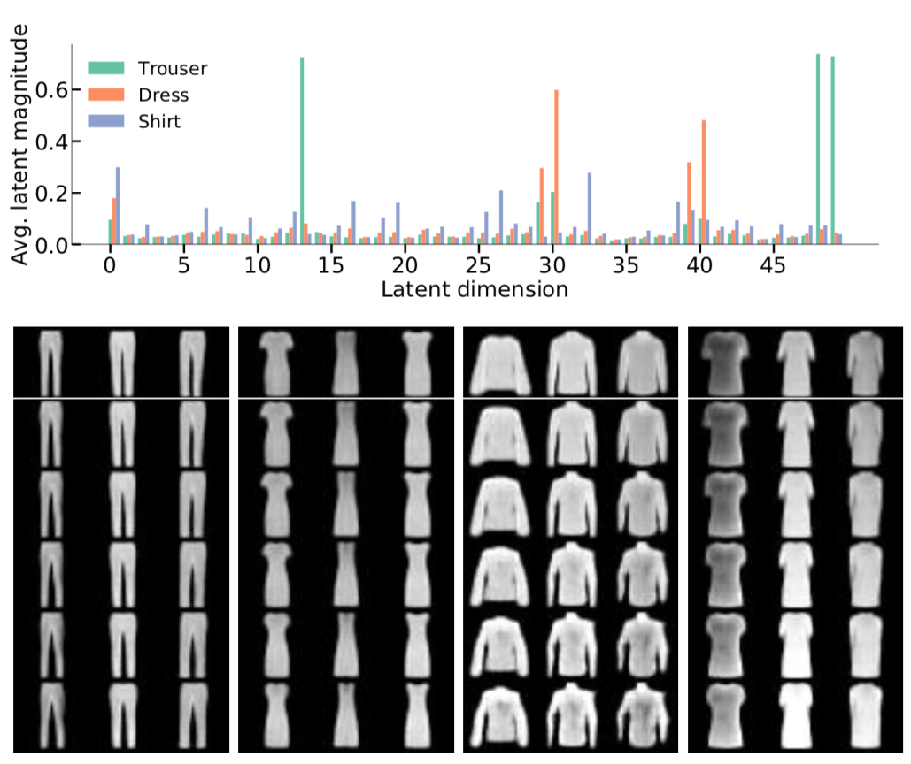

# [Disentangling Disentanglement in Variational Autoencoders](https://arxiv.org/abs/1812.02833)

This repository provides the code accompanying the paper.

*Illustration of decomposition where the desired structure is a cross shape (enforcing sparsity), expressed through the prior p(z) as shown on the left.
In the scenario where there is insufficient overlap [top], we observe a lookup table behavior: points that are close in the data space are not close in the latent space and so the latent space loses meaning.
In the scenario where there is too much overlap [bottom], the latent variable and observed datapoint convey little information about one another, such that the latent space again loses meaning.
Note that if the distributional form of the latent distribution does not match that of the prior, as is the case here, this can also prevent the aggregate encoding matching the prior when the level of overlap is large.*

## Prerequisites
`pip install -r requirements.txt`

## Run experiments
First, `cd src`.


### Train model
Execute the `main.py` script with python3:

`python main.py --model MODEL_NAME` where `MODEL_NAME` can be `dsprites`, `pinwheel` or `fashion_mnist`.

Other arguments are defined at the top of the `main.py` file.
You can find argument settings used in our experiments in `experimental_settings/`:  `independence.sh`, `clustering.sh` and `sparsity.sh`.

### Compute metrics and generate plots

`python analyse.py --save-dir PATH_TO_SAVED_EXPERIMENT` with optional arguments:
* `--disentanglement` to compute the disentanglement metric (Kim et al 2018)
* `--sparsity` to compute the normalised Hoyer metric
* `--logp` and `--iwae-samples 1000` to estimate the marginal log-likelihood via IWAE

*[Top] Average encoding magnitude over data for three example classes in Fashion-MNIST, [Bottom] Latent interpolation for different datapoints (top layer) along particular 'active' dimensions. (a) Separation between the trouser legs (dim 49).
(b) Top/Collar width of dresses (dim 30).
(c) Shirt shape (loose/fitted, dim 19).
(d) Style of sleeves across different classes---t-shirt, dress, and coat (dim 40).*


## References
If you find this code useful for your research, please cite the following paper in your publication:

```
@InProceedings{pmlr-v97-mathieu19a,
  title	       = {Disentangling Disentanglement in Variational Autoencoders},
  author       = {Mathieu, Emile and Rainforth, Tom and Siddharth, N and Teh, Yee Whye},
  booktitle    = {Proceedings of the 36th International Conference on Machine Learning},
  pages	       = {4402--4412},
  year	       = 2019,
  editor       = {Chaudhuri, Kamalika and Salakhutdinov, Ruslan},
  volume       = 97,
  series       = {Proceedings of Machine Learning Research},
  address      = {Long Beach, California, USA},
  month	       = {09--15 Jun},
  publisher    = {PMLR},
}
```
